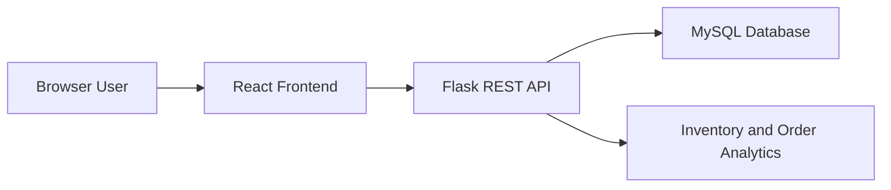

# Ecommerce Mart: Three-Tier E-Commerce Cloud Project

Ecommerce Mart is a full-stack academic project for an M.Tech student. It demonstrates a three-tier e-commerce architecture with a React presentation tier, Flask REST API application tier, MySQL data tier, Docker Compose for local orchestration, and Kubernetes manifests for cloud-native deployment.

## Project Objectives

- Build a working e-commerce catalog with cart and checkout simulation.
- Expose REST APIs for products, categories, orders, health checks, and analytics.
- Demonstrate separation of concerns across frontend, backend, and database tiers.
- Package services with Docker and deploy them with Kubernetes manifests.
- Provide a clear base for report writing, viva explanation, and future research extensions.

## Architecture



## Tech Stack

| Layer | Technology |
| --- | --- |
| Frontend | React, CSS |
| Backend | Python, Flask, Flask-CORS |
| Database | MySQL 8 |
| Local Runtime | Docker Compose |
| Deployment | Kubernetes manifests, Helm chart scaffold |

## Features

- Product catalog with category filtering and search.
- JSON product dataset in `backend/data/products.json`.
- Cart quantity controls and checkout simulation.
- GST, shipping, subtotal, and total calculation.
- Order creation endpoint with stock validation.
- Analytics endpoint for category, inventory, price segment, catalog, and order metrics.
- Health endpoint for Kubernetes probes.
- Docker Compose setup with MySQL seed script.
- Kubernetes deployments, services, probes, and resource limits.

## Run Locally Without Docker

Start the backend:

```bash
cd backend
pip install -r requirements.txt
python app.py
```

Start the frontend in another terminal:

```bash
cd frontend
npm install
npm start
```

Open `http://localhost:3000`.

## Run With Docker Compose

```bash
docker compose up --build
```

Services:

- Frontend: `http://localhost:3000`
- Backend API: `http://localhost:5000`
- MySQL: `localhost:3306`

## API Endpoints

| Method | Endpoint | Purpose |
| --- | --- | --- |
| GET | `/api/health` | Service health status |
| GET | `/api/products` | List products |
| GET | `/api/products?q=laptop` | Search products |
| GET | `/api/products?category=Audio` | Filter products |
| GET | `/api/categories` | List categories |
| POST | `/api/orders` | Create an order |
| GET | `/api/orders` | List created orders |
| GET | `/api/analytics` | Inventory and revenue metrics |

## Add More Products

Add new objects to `backend/data/products.json` using the same fields:

```json
{
  "id": 21,
  "name": "New Product",
  "category": "Accessories",
  "price": 1999,
  "rating": 4.2,
  "stock": 25,
  "description": "Short product description.",
  "brand": "BrandName"
}
```

Restart the backend or rerun Docker Compose after changing the dataset.

Sample order request:

```json
{
  "customer": {
    "name": "Ecommerce Evaluator",
    "email": "evaluator@example.com"
  },
  "items": [
    { "productId": 1, "quantity": 1 },
    { "productId": 3, "quantity": 2 }
  ]
}
```

## Kubernetes Deployment

Build local images:

```bash
docker build -t ecommerce-backend:v1 ./backend
docker build -t ecommerce-frontend:v1 ./frontend
```

Apply manifests:

```bash
kubectl apply -f k8s/mysql-secret.yaml
kubectl apply -f k8s/mysql-deployment.yaml
kubectl apply -f k8s/mysql-service.yaml
kubectl apply -f k8s/backend-deployment.yaml
kubectl apply -f k8s/backend-service.yaml
kubectl apply -f k8s/frontend-deployment.yaml
kubectl apply -f k8s/frontend-service.yaml
```

Check status:

```bash
kubectl get pods
kubectl get services
```

For Minikube:

```bash
minikube service frontend-service
```

Deploy with Helm:

```bash
helm install ecommerce-mart ./ecommerce-chart
```

## Suggested M.Tech Report Structure

1. Introduction and motivation
2. Literature review on cloud-native e-commerce systems
3. Problem statement and objectives
4. System architecture and module design
5. Database schema and API design
6. Implementation details
7. Containerization and Kubernetes deployment
8. Testing and results
9. Limitations
10. Future scope

## Future Enhancements

- Persist Flask order operations directly to MySQL.
- Add authentication with customer and admin roles.
- Add payment gateway sandbox integration.
- Add Prometheus metrics and Grafana dashboards.
- Add CI/CD pipeline using GitHub Actions or Jenkins.
- Replace `emptyDir` with persistent volumes for Kubernetes MySQL.
